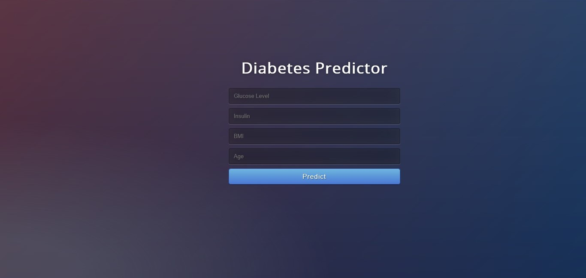

## Diabetes Predictor
> Predict Diabetes using Machine Learning.

# **Screenshot**

# Installation

- Clone this repository and unzip it.

- After downloading, `cd` into the `flask` directory.

- Begin a new virtual environment with Python 3 and activate it.

- Install the required packages using 
   `pip install -r requirements.txt`

- Execute the command:
   `python app.py`

